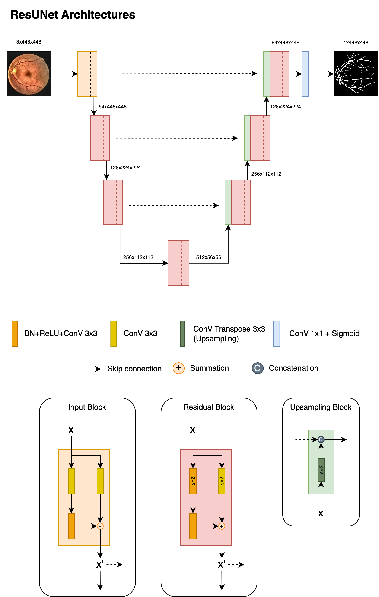

# ResUNET Vessel Segmentation
This project is aimed to implement model that can extract vessels from retinal images efficiently using implementation adopted by Residual Network (Resnet) and UNet for DRIVE datasets.

The model architectures are described below:

